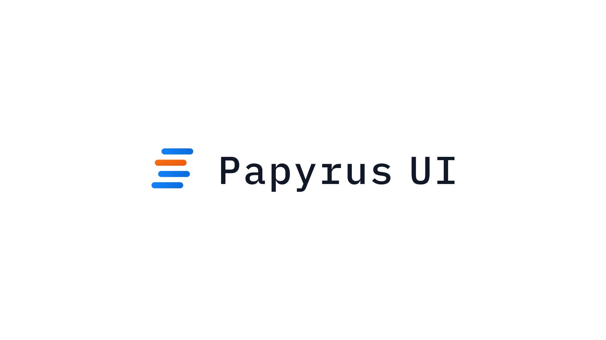

# Papyrus UI



A modern React UI kit with fundamental components built on Tailwind CSS, designed for rapid application development with a consistent design system.

## Features

- 🎨 **Design System**: Consistent, accessible components following modern design principles
- ⚡ **Tailwind CSS**: Built with Tailwind CSS for rapid styling and customization
- 🎯 **TypeScript**: Full TypeScript support with comprehensive type definitions
- 🔧 **Customizable**: Easy theming and customization through Tailwind config
- 📱 **Responsive**: Mobile-first responsive design out of the box

## Quick Start

### 1. Installation

Install the package using npm:

```bash
npm install tailwindcss papyrus-ui
```

### 2. Setup Tailwind CSS

Create a `tailwind.config.js` file in your project root:

```js
/** @type {import('tailwindcss').Config} */
module.exports = {
  content: [
    './src/**/*.{js,ts,jsx,tsx}',
    './node_modules/papyrus-ui/**/*.{js,ts,jsx,tsx}',
  ],
  presets: [require('papyrus-ui/plugin')],
  theme: {
    extend: {},
  },
  plugins: [],
};
```

### 4. Use Components

Start using components in your application:

```tsx
import { Button, TextInput, Tag } from 'papyrus-ui';

function App() {
  return (
    <div className="p-4">
      <Button>Click Me!</Button>
      <TextInput placeholder="Enter text..." />
      <Tag>Label</Tag>
    </div>
  );
}
```

## Component Library

The library includes a comprehensive set of 40+ components organized into logical categories:

### 🎯 **Core Interactive Elements**

- **Button** - Primary interaction element for actions and navigation
- **IconButton** - Compact button optimized for icon-only interactions
- **Link** - Accessible navigation link with hover states

### 📝 **Form Components**

- **TextInput** - Text field with error states and validation
- **NumericInput** - Number input with formatting and step controls
- **TimeInput** - Time picker supporting 12/24 hour formats
- **Textarea** - Multi-line text area with error handling
- **Select** - Dropdown for single or multiple option selection
- **Checkbox** - Multi-option selection input
- **CheckboxGroup** - Coordinated checkbox group with shared state
- **Radio** - Single-option selection from multiple choices
- **RadioGroup** - Radio button group with single-selection logic
- **Range** - Slider input with real-time value display
- **Autocomplete** - Input with type-ahead suggestions and filtering
- **ImageInput** - Image upload input with dropzone preview and multi-select support
- **InputMessage** - Validation feedback and user guidance messages

### 🏷️ **Data Display**

- **Tag** - Visual element for categories and status indicators
- **Badge** - Compact notification badge for counts and alerts
- **Avatar** - User representation with fallback to initials
- **Skeleton** - Loading placeholder that maintains layout
- **Icon** - Consistent SVG icon wrapper with uniform sizing

### 📊 **Data Presentation**

- **Table** - Feature-rich table with variants, borders, and striped rows

### 📝 **Typography**

- **Heading** - Semantic heading hierarchy (h1-h6) with consistent styling
- **Text** - Typography component for paragraphs and content
- **Label** - Accessible form labels with essential context
- **Caption** - Caption text for images and supplementary info
- **Quote** - Blockquote with citation support
- **OList** - Ordered lists with various styling options
- **UList** - Unordered lists with customizable bullets
- **Marker** - Custom marker container for unordered lists
- **Code** - Inline code snippet styling for text content
- **CodeBlock** - Formatted code display with syntax highlighting, line numbers, and copy support

### 🎨 **Layout & Structure**

- **Divider** - Clean separators for visual organization

### 🎪 **Overlays & Modals**

- **Dialog** - Modal system with backdrop and focus management
- **Popover** - Floating content overlay with smart positioning
- **Tooltip** - Information popup on hover, click, or focus
- **Snackbar** - Discreet notification with auto-dismiss

### 🍽️ **Navigation & Menus**

- **Menu** - Dropdown navigation with keyboard accessibility
- **MenuBar** - Horizontal navigation bar for applications
- **DropdownMenu** - Context-sensitive menu with positioning

### ⚡ **Feedback & States**

- **Alert** - Prominent notification for critical messages
- **Loader** - Loading indicator in various sizes

## Customization

### Theme Customization

You can customize the design system by extending the Tailwind configuration:

```js
module.exports = {
  presets: [require('papyrus-ui/plugin')],
  theme: {
    extend: {
      colors: {
        primary: {
          50: '#f0f9ff',
          100: '#e0f2fe',
          500: '#0ea5e9',
          600: '#0284c7',
          700: '#0369a1',
        },
        secondary: {
          50: '#f8fafc',
          100: '#f1f5f9',
          500: '#64748b',
          600: '#475569',
          700: '#334155',
        },
      },
      borderRadius: {
        xl: '1rem',
      },
    },
  },
};
```

### Component Variants

Most components support multiple variants and sizes:

```tsx
// Button variants
<Button variant="primary">Primary</Button>
<Button variant="secondary">Secondary</Button>
<Button variant="tertiary">Tertiary</Button>

// Button sizes
<Button size="sm">Small</Button>
<Button size="md">Medium</Button>
<Button size="lg">Large</Button>
```

## Browser Support

- Chrome (latest)
- Firefox (latest)
- Safari (latest)
- Edge (latest)

## License

This project is licensed under the MIT License. See the [LICENSE](LICENSE) file for details.

## Contributing

We welcome contributions to enhance Papyrus UI! Here's how you can help:

1. **Fork** the repository
2. **Create** a feature branch (`git checkout -b feature/amazing-feature`)
3. **Commit** your changes (`git commit -m 'Add some amazing feature'`)
4. **Push** to the branch (`git push origin feature/amazing-feature`)
5. **Open** a Pull Request

### Development Setup

```bash
# Clone the repository
git clone https://github.com/your-username/papyrus-ui.git

# Install dependencies
cd papyrus-ui
pnpm install

# Start development
pnpm storybook

# Run tests
pnpm test

# Build the package
pnpm build
```

For bug reports and feature requests, please [open an issue](https://github.com/your-username/papyrus-ui/issues) on GitHub.
